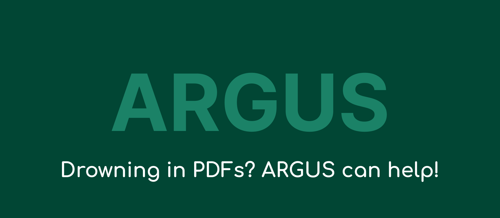

Welcome to ARGUS!
-------------------

**ARGUS: Automated Research Guidance & User Support**

Objective
-----------

ARGUS, your ultimate research companion, is here to transform the way you conduct literature reviews. Whether you're delving into the depths of academia or exploring the frontiers of scientific research, ARGUS simplifies the process by automating key tasks, saving you time and effort. 

With ARGUS, interdisciplinary researchers can effortlessly survey research papers based on their provided keywords, swiftly gathering relevant literature to inform their studies. Say goodbye to the tedious manual process and embrace the efficiency of ARGUS. It's time to unlock new insights and propel your research forward!

.. note::
   
   Dive in and explore ARGUS's powerful features. Keep an eye out for future updates as we continue to enhance your research experience!

Ready to revolutionize your literature reviews? Let ARGUS lead the way!

.. toctree::
   :hidden:
   :maxdepth: 10
   :caption: Information

   pages/index
   pages/introduction

.. toctree::
   :hidden:
   :maxdepth: 10
   :caption: How to use?

   pages/howtouse1
   pages/howtouse2

.. toctree::
   :hidden:
   :maxdepth: 10
   :caption: Architecture

   pages/architecture1
   pages/architecture2

.. toctree::
   :hidden:
   :maxdepth: 10
   :caption: Functionality

   pages/functionality
   pages/Reading and Scanning
   pages/Future Advancements

.. toctree::
   :hidden:
   :maxdepth: 10
   :caption: Conclusion

   pages/Conclusion

.. toctree::
   :hidden:
   :maxdepth: 10
   :caption: Author

   pages/Author